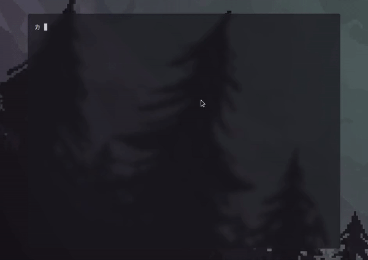

<div align="center">
  
</div>

<br/>

- [Features](#features) <br/>
- [Install](#how-to-install) <br/>
- [Arguments](#arguments) <br/>
- [Usage](#how-to-use) <br/><br/>

<div align="center">
  
</div>

### Features:
- Pacman's package downgrade
- AUR Helper with search and choose
- AUR's package downgrade
- AUR's package update

<br/>

### How to install:
```sh
$ cargo install --git https://github.com/imf4ll/opio.git
```

or with autocompletion:
```sh
$ git clone https://github.com/imf4ll/opio.git

$ cd opio/

$ make install
```

<br/>

### Arguments:
| Name | Description | Usage |
|------|-------------|-------|
| -i, --install | Install first valid package from AUR | PACKAGE |
| -d, --downgrade | Turns on downgrade mode | PACKAGE |
| -a, --aur | Prioritize AUR mode | - |
| -u, --update | Update a package from AUR to latest version | PACKAGE |
| -s, --search | Search for a package in AUR | PACKAGE |
| -f, --file-path | Final package download path | PATH |
| -k, --keep | Keep AUR package after installing | - |
| --ignore-cache | Ignores packages from cache while downgrading 'pacman' packages | - |
| --pkgbuild | Shows PKGBUILD before install | - |
| --status | Check Archive and AUR status | - |
| --upgrade | Self update 'opio' to latest version | - |
| -h, --help | Print help | - |
| -V, --version | Print version | - |

<br/>

### How to use:
- Install first valid package from AUR:
```sh
$ opio -i alacritty
```

<br/>

- Search and choose through AUR:
```sh
$ opio -s alacritty
```

<br/>

- Update a package from AUR to latest version
```sh
$ opio -u brave-bin
```

<br/>

- Downgrade 'pacman' package: (REQUIRES ROOT PRIVILEGES)
```sh
$ sudo opio -d xsel
```

<br/>

- Downgrade 'AUR' package:
```sh
$ opio -a -d brave-bin
```

<br/>
